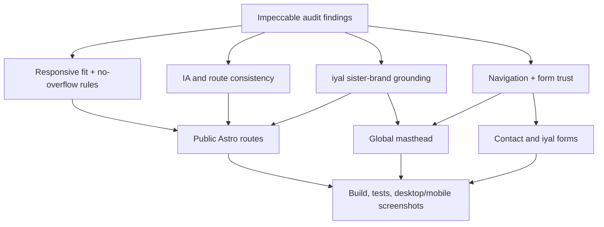

# Site Improvement Layer - Plan

## Goal Capsule

- **Objective:** Improve the personal website in three ordered passes: responsive fit plus IA drift, iyal copy and positioning, then navigation and contact trust.
- **Product authority:** The `$impeccable` audit snapshot at `.impeccable/critique/2026-07-01T07-00-46Z__src.md`, the repo instructions in `AGENTS.md`, and the user's decisions in this session.
- **Execution profile:** Code implementation in the existing Astro and Tailwind site.
- **Open blockers:** None. The user selected the priority order, route strategy, and iyal positioning.

---

## Product Contract

### Summary

The site will keep its magazine-of-one identity while fixing the places where that identity currently frays: mobile clipping, stale IA promises, abstract iyal copy, and a too-soft contact path.
`To` remains the navigation label, `/ambitions` becomes an alias instead of a dead route, and `iyal` stays masthead-level as a sister brand that earns its prominence through clearer context and more grounded copy.

### Problem Frame

The site is already distinctive, but the audit found trust leaks at the exact moments that should feel most precise.
On mobile, Contact and iyal text clips past the viewport.
In IA, docs and source disagree about Ambitions, To, and Writing lenses.
In content, iyal carries the right ambition but sometimes speaks in product-memo abstractions instead of the site's first-person voice.
In navigation, the conversion path exists but is less discoverable than secondary sections.

### Key Decisions

- **One-by-one priority order:** Responsive fit and IA drift ship first, iyal copy and positioning second, and navigation/contact trust third.
- **To plus Ambitions alias:** The public nav keeps `To` because it fits the site's editorial language, while `/ambitions` exists as a route alias so old docs, links, and mental models do not 404.
- **iyal as masthead-level sister brand:** The `iyal` wordmark remains beside `SK.` and should feel like a sister masthead, not a hidden project card or generic venture link.
- **Improve without re-skinning:** The work should tighten the current design system, not introduce a new aesthetic, palette, card system, or unrelated visual language.
- **Honor current To expansion:** The Waste Management page and To index edits already in the working tree are in scope and should be preserved.

### Requirements

**Responsive Fit**

- R1. Mobile pages must not clip text or controls horizontally at common narrow widths.
- R2. Long uppercase labels, large display headlines, and body copy must wrap or scale gracefully on Contact, iyal, Home, and To detail pages.
- R3. The header must keep `SK.`, `iyal`, theme control, and menu access visible or intentionally simplified on mobile.

**IA and Content Model**

- R4. `/ambitions` must resolve as an alias for the future-desk experience rather than a 404.
- R5. The live IA, docs, and page copy must agree on `To`, Ambitions-as-alias, iyal, Modelling, Contact, and the To detail pages.
- R6. Writing lenses must stop promising a missing fourth lens unless Philosophy is intentionally restored as an honest empty or active lens.
- R7. The Modelling content collection warning must be removed or made intentional without faking modelling work.

**iyal**

- R8. iyal must remain masthead-level and get enough inline context that a first-time visitor understands why it sits beside `SK.`.
- R9. iyal copy must use concrete agricultural scenes, trust moments, and field-note language instead of generic ecosystem/product memo language.
- R10. iyal must keep its active-research honesty: no overclaiming a launched product or proven platform.

**Navigation and Contact Trust**

- R11. Contact must be reachable from the global navigation system, including the cube/menu experience.
- R12. Contact and iyal forms must set expectations for replies and offer a fallback email if the form fails.
- R13. Form behavior must be safe when `PUBLIC_WEB3FORMS_ACCESS_KEY` is missing.

**Design System Integrity**

- R14. Fixes must preserve the no-card, no-shadow, one-blue editorial system.
- R15. Cream theme muted text must meet AA contrast for normal small text.
- R16. Reveal motion must enhance already-visible content rather than making content invisible when JavaScript fails.

### Key Flows

- F1. **First-time mobile visitor:** A visitor lands on Home, sees the masthead, portrait, and identity without clipped text or hidden controls, then opens the menu and understands the main destinations.
- F2. **Future-desk visitor:** A visitor opens `To`, sees the future work list including Waste Management, and can reach the same experience from `/ambitions`.
- F3. **iyal visitor:** A visitor clicks the masthead `iyal` wordmark, understands it as active agricultural research, and reaches a grounded field-note form.
- F4. **Contact visitor:** A visitor reaches Contact from global navigation, understands what to send, knows what happens after submission, and has a fallback email.

### Acceptance Examples

- AE1. Given a 390px-wide viewport, when the visitor opens `/contact`, then the header, hero headline, meta line, prose, fields, and submit affordance fit without horizontal clipping.
- AE2. Given a 390px-wide viewport, when the visitor opens `/iyal`, then the kicker, wordmark, headline, body copy, and form fit without horizontal clipping.
- AE3. Given a request to `/ambitions`, when the site builds statically, then the route resolves to the To experience rather than the 404 page.
- AE4. Given the Writing page, when the visible lenses are rendered, then page copy and schema do not imply an unavailable Philosophy lens unless an honest Philosophy lens is present.
- AE5. Given JavaScript fails to run, when a visitor loads a page with reveal effects, then content remains visible.
- AE6. Given no Web3Forms access key is configured, when the Contact or iyal page renders, then the visitor gets a safe fallback instead of a dead submission path.

### Scope Boundaries

#### In Scope

- Responsive typography and layout fixes for current public routes.
- IA aliasing and documentation alignment for To, Ambitions, Writing, Modelling, Contact, and Waste Management.
- iyal copy rewrite and masthead-context improvements.
- Contact discoverability and form trust copy.
- Small design-system hardening needed by the audit.

#### Deferred for Later

- New photography, image-generation, or photo replacement.
- Analytics, deployment, domain, and hosting decisions.
- Full search/filtering for Writing or Reading.
- New backend form handling beyond the existing Web3Forms/static-site approach.

#### Outside This Product's Identity

- Turning the site into a SaaS-style funnel with hero metrics, CTA blocks, card grids, or trust-logo sections.
- Demoting iyal to a normal project card.
- Pretending Modelling, iyal, or To ideas are more complete than they are.

### Success Criteria

- The site builds and tests pass after implementation.
- Browser screenshots at desktop and mobile widths show no obvious clipping on Home, Contact, iyal, and representative To pages.
- `/ambitions` no longer returns 404.
- iyal reads more like a grounded field note and less like a generic systems-change brief.
- Contact feels reachable and trustworthy without adding heavy UI chrome.

### Sources / Research

- `.impeccable/critique/2026-07-01T07-00-46Z__src.md`
- `AGENTS.md`
- `docs/DESIGN_SYSTEM.md`
- `docs/VOICE.md`
- `docs/ARCHITECTURE.md`
- `docs/DECISIONS.md`

---

## Planning Contract

### Product Contract Preservation

Product Contract unchanged except for enrichment metadata and implementation sections.

### Key Technical Decisions

- KTD1. **Use existing editorial primitives.** Fix layout with token-driven CSS, wrapping constraints, route aliases, and Astro pages rather than adding a component library or a new design layer.
- KTD2. **Alias Ambitions without renaming To.** Keep `To` as the visible editorial label and add `/ambitions` as a static alias so old references do not reach 404.
- KTD3. **Treat iyal as a sister masthead.** Keep the wordmark in the header, but add context and grounded page copy so the prominence feels earned.
- KTD4. **Prefer static fallbacks over richer form behavior.** Keep Web3Forms, but render fallback mailto paths and safe no-key states instead of adding backend logic.
- KTD5. **Make motion progressive.** Content is visible by default; JavaScript may add reveal choreography after readiness is known.

### High-Level Technical Design

### Assumptions

- `To` remains the public navigation label.
- `/ambitions` should show the same future-desk experience rather than becoming a divergent page.
- `iyal` remains visible in the masthead on desktop and mobile.
- Existing uncommitted Waste Management work is user-authored and must be preserved.

### Risks & Dependencies

- **Mobile typography:** The largest risk is fixing clipping without making the editorial type feel timid.
- **Form fallback:** Web3Forms behavior is external; the site can only make missing-key and fallback states clear.
- **User-authored changes:** The current dirty files must be edited carefully to avoid losing new Waste Management content.

---

## Implementation Units

### U1. Responsive Fit And Theme Hardening

- **Goal:** Remove mobile clipping and contrast failures while preserving editorial scale.
- **Requirements:** R1, R2, R3, R15, AE1, AE2
- **Dependencies:** None.
- **Files:** `src/styles/global.css`, `src/components/Header.astro`, `src/pages/contact.astro`, `src/pages/iyal.astro`, `src/pages/to/waste-management.astro`, `tests/responsive-content.test.ts`
- **Approach:** Add reusable text-fit utilities for long tracked labels and prose containers, lower risky mobile clamp minimums where needed, ensure header controls stay reachable, and adjust cream muted contrast through the token system.
- **Patterns to follow:** Existing token declarations in `src/styles/global.css`; current header structure in `src/components/Header.astro`; page-level editorial classes in Contact and iyal.
- **Test scenarios:**
  - Covers AE1. Assert Contact uses the site text-fit guardrails on the hero heading, header metadata, form labels, and long supporting prose.
  - Covers AE2. Assert iyal uses the site text-fit guardrails on the kicker, hero, body, and form sections.
  - Assert the cream `text-muted` token is changed to an AA-safe value relative to `theme-cream` background.
  - Assert the mobile masthead keeps both brand links and menu/theme controls in the source order.
- **Verification:** `npm test`, `npm run build`, and mobile screenshots for `/contact` and `/iyal` show no horizontal clipping.

### U2. IA Drift And Route Consistency

- **Goal:** Align live routes, docs, and content model around `To`, `/ambitions`, Writing lenses, Modelling, and the current To pages.
- **Requirements:** R4, R5, R6, R7, AE3, AE4
- **Dependencies:** U1 only when shared text-fit utilities are referenced by To pages.
- **Files:** `src/pages/ambitions.astro`, `src/lib/writing.ts`, `src/content.config.ts`, `docs/ARCHITECTURE.md`, `docs/DECISIONS.md`, `tests/ia-routes.test.ts`
- **Approach:** Add an Ambitions alias page for the To experience, remove ghost Philosophy promises unless content exists, and resolve the Modelling collection warning without creating fake modelling entries.
- **Patterns to follow:** The current To index and route structure; existing Vitest source-text assertions.
- **Test scenarios:**
  - Covers AE3. Assert `src/pages/ambitions.astro` exists and routes to the To/future-desk experience.
  - Covers AE4. Assert visible Writing lens copy and exported lens keys do not promise unavailable Philosophy content.
  - Assert the modelling collection no longer points to a missing directory or the directory exists as an intentional empty collection.
  - Assert docs mention `/to`, `/ambitions`, and `/to/waste-management` consistently.
- **Verification:** `npm test`, `npm run build`, and a route probe confirms `/ambitions` returns the future-desk page.

### U3. iyal Copy And Sister-Masthead Positioning

- **Goal:** Make iyal's masthead prominence self-explanatory and rewrite iyal copy around grounded agricultural scenes.
- **Requirements:** R8, R9, R10, F3
- **Dependencies:** U1.
- **Files:** `src/components/Header.astro`, `src/pages/iyal.astro`, `docs/DECISIONS.md`, `tests/iyal-positioning.test.ts`
- **Approach:** Add accessible context for the iyal wordmark, keep the visual mark prominent, and replace abstract strategy language with field-note copy about seasonal planning, trust, cash flow, logistics, and people already doing the work.
- **Patterns to follow:** Voice rules in `docs/VOICE.md`; existing iyal script wordmark; honest aspiration framing in Modelling and To pages.
- **Test scenarios:**
  - Assert the header exposes iyal as a labelled sister masthead rather than an unexplained decorative script link.
  - Assert iyal copy contains concrete field-note concepts and avoids the audited generic strategy terms.
  - Assert iyal still says active research/validation rather than launched product.
- **Verification:** `npm test`, `npm run build`, and visual review of `/iyal` desktop and mobile.

### U4. Navigation And Contact Trust

- **Goal:** Make Contact reachable globally and make form outcomes feel trustworthy.
- **Requirements:** R11, R12, R13, F4, AE6
- **Dependencies:** U1, U3.
- **Files:** `src/components/Header.astro`, `src/components/CubeMenu.astro`, `src/components/Footer.astro`, `src/pages/contact.astro`, `src/pages/iyal.astro`, `tests/contact-forms.test.ts`, `tests/contact-links.test.ts`
- **Approach:** Add Contact to the global menu system without overcrowding the desktop masthead, add reply/fallback copy near both forms, and render safe mailto fallbacks when the Web3Forms key is absent.
- **Patterns to follow:** Existing footer Contact route; existing EditorialField form style; cube menu accessible nav list.
- **Test scenarios:**
  - Assert Contact appears in the accessible cube/menu navigation.
  - Assert global navigation still keeps the editorial masthead uncluttered.
  - Covers AE6. Assert Contact and iyal render fallback email affordances when no Web3Forms access key is available.
  - Assert form reassurance copy includes what kind of reply to expect without becoming a marketing CTA.
- **Verification:** `npm test`, `npm run build`, and visual review of `/contact` desktop and mobile.

### U5. Motion, Chrome, And Final Polish

- **Goal:** Remove fragile reveal behavior and small design-system drifts caught by the audit.
- **Requirements:** R14, R16, AE5
- **Dependencies:** U1, U2, U3, U4.
- **Files:** `src/styles/global.css`, `src/scripts/reveal.ts`, `src/components/CubeMenu.astro`, `src/layouts/BaseLayout.astro`, `docs/DESIGN_SYSTEM.md`, `docs/DECISIONS.md`, `tests/reveal.test.ts`
- **Approach:** Gate reveal hiding behind a JS-ready class, reduce cube shadow drift to flat editorial separation, and fix the default meta description that implies a designer identity.
- **Patterns to follow:** Reduced-motion handling in `src/styles/global.css`; existing theme no-flash inline script in `src/layouts/BaseLayout.astro`; flat-rule guidance in `docs/DESIGN_SYSTEM.md`.
- **Test scenarios:**
  - Covers AE5. Assert reveal CSS does not hide content by default before JavaScript marks the document ready.
  - Assert reduced-motion behavior remains instant and visible.
  - Assert CubeMenu no longer uses a large decorative shadow.
  - Assert default metadata does not call Sundharesan a designer.
- **Verification:** `npm test`, `npm run build`, and final desktop/mobile screenshots for Home, Contact, iyal, and To.

---

## Verification Contract

| Gate | Applies To | Done Signal |
|---|---|---|
| `npm test` | All units | Vitest passes with unit/source assertions updated for the new behavior. |
| `npm run build` | All units | Astro static build completes without the previous missing modelling directory warning. |
| Browser screenshots | U1, U3, U4, U5 | Home, Contact, iyal, and To pages render at desktop and mobile widths without clipping or incoherent overlap. |
| Route probe | U2 | `/ambitions` resolves to a future-desk page, not 404. |

---

## Definition of Done

- All U1-U5 units are implemented and verified.
- Product Contract requirements R1-R16 are satisfied or explicitly deferred in code comments/docs only where the Product Contract allows deferral.
- No user-authored uncommitted Waste Management work is lost.
- `npm test` and `npm run build` pass.
- Mobile screenshots for Contact and iyal show no clipped text.
- The final diff removes abandoned experiments and keeps the editorial system flat, token-driven, and one-blue.
